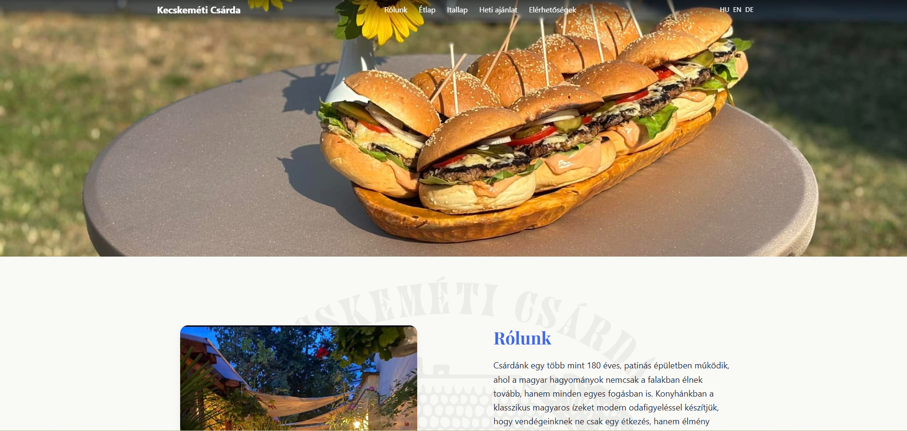
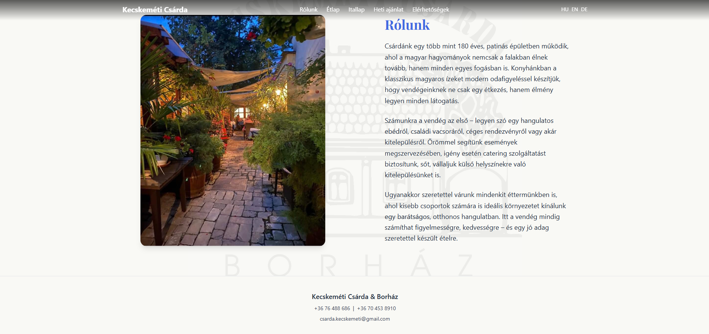
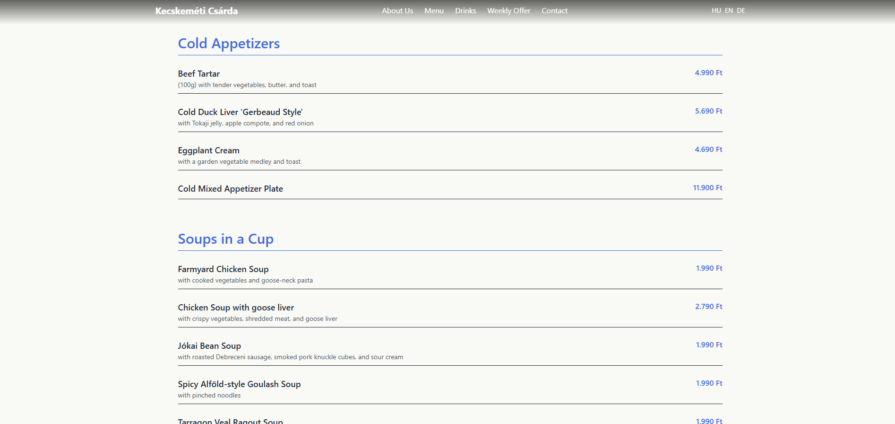
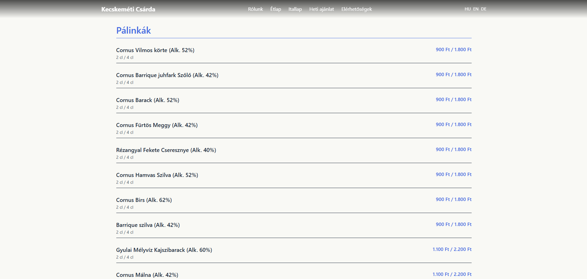
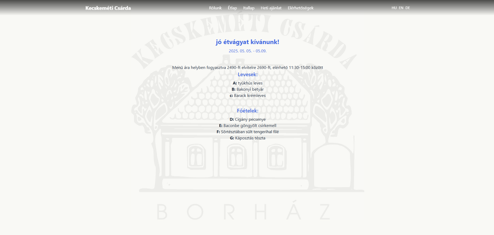

# 🏠 Csárda Web – Laravel + Docker Project

[](https://laravel.com/)
[]
[]
[]
[]
[]

A modern restaurant website built with Laravel, running in Docker containers with Nginx and MariaDB. Frontend is handled by Vite and Tailwind CSS.

---

## 📁 File Structure

- `docker-compose.yml`: Container configuration
- `Dockerfile`: PHP-FPM build for Laravel
- `nginx/default.conf`: Nginx server config
- `.env`: Environment variables, database credentials, and app settings
- `resources/`: Blade templates, translations, assets

---

## 🚀 Getting Started

### **Prerequisites**
- Docker & Docker Compose
- Node.js & npm (for frontend build)
- Composer

### **Setup Steps**

1. **Clone the repository**
    ```sh
    git clone https://github.com/your_username/csarda-web.git
    cd csarda-web
    ```

2. **Create your .env file**
    ```sh
    cp .env.example .env
    ```
   Edit database, app and asset settings as needed.

3. **Install dependencies**
    ```sh
    composer install
    npm install
    ```

4. **Build frontend assets**
    ```sh
    npm run build
    ```

5. **Start the containers**
    ```sh
    docker compose up -d --build
    ```

6. **Run migrations and seeders**
    ```sh
    docker compose exec app php artisan migrate --seed
    ```

7. **Open your browser:**
   [http://localhost:8000](http://localhost:8000)

---

## 🗃️ Data Model & Menu Structure

> **Note:**  
> All menu (meals) and drink items are stored in language-specific JSON files.  
> Only static reference data (e.g. allergen definitions and translations) are stored in the database.

---

### Menu & Drink List

- The menu (`etlap`) and drink list (`italap`, coming soon) are stored as JSON files for each language:
    ```
    /resources/lang/
        ├── hu/
        │    ├── app.php
        │    ├── etlap_hu.json
        │    └── itallap_hu.json
        ├── en/
        │    ├── app.php
        │    ├── etlap_en.json
        │    └── itallap_en.json
        └── de/
             ├── app.php
             ├── etlap_de.json
             └── itallap_de.json
    ```
- **Each JSON file contains the full menu in the relevant language, including translations, categories, and items.**

#### Example `etlap_en.json`:
```json
{
    "category": "Soups in a Cup",
    "items": [
        {
            "name": "Farmyard Chicken Soup",
            "description": "with cooked vegetables and goose-neck pasta",
            "price": 1900,
            "allergens": []
        },
        {
            "name": "Jókai Bean Soup",
            "description": "with sausage, beans, and vegetables",
            "price": 2290,
            "allergens": ["gluten", "celery"]
        }
    ]
}
```

- When rendering the menu, the app **matches the slugs from the item's `"allergens"` array** to the allergen definitions/translations in the database, so it can display the correct names (in the selected language) and icons if needed.


---

**Summary:**
- *Allergen slugs and translations live in the DB.*
- *The association between a meal and its allergens is managed in the JSON files, by referencing those slugs in the `"allergens"` array for each item.*

## 🔄 Reset and Reseed the Database

To **completely reset the database and repopulate seed data**:
```sh
docker compose exec app php artisan migrate:fresh --seed
```

## 🗺️ Roadmap

- [x] Basic multilingual meal types, categories, and meals
- [x] Multi-language support (hu, en, de)
- [x] Responsive design with Tailwind CSS
- [x] Dockerized Laravel + Nginx + MariaDB setup
- [x] Admin authentication & authorization
- [x] Admin-controlled weekly menu

### Planned Features

- [ ] **Allergen management**
    - [ ] Add allergen assignment for each meal (in admin)
    - [ ] Display allergens in all supported languages

- [ ] **Meal images**
    - [ ] Image upload for each meal (admin)

- [ ] **Gallery page**
    - [ ] Add photo gallery with images of the restaurant

## 📸 Screenshots

### Home Page


### About Section


### Menu Example


### Drink List Example


### Weekly Offer


### Contacts Page

